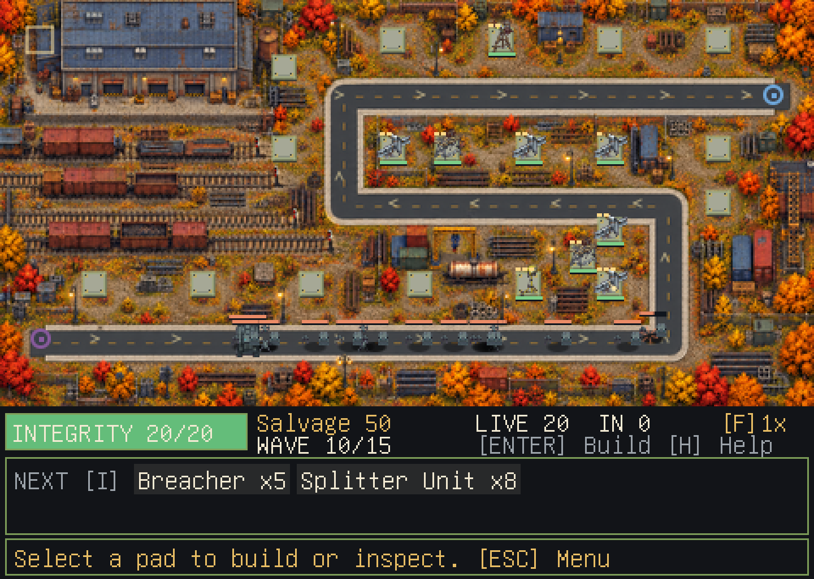

# Pleb Tower

An autonomous pacification force — **the Array** — has designated Maple Loop a
non-compliant sector. It does not hate anyone. It is running a procedure.

Waves of machines walk up the loop to process the block, and the residents have
garages, a hardware store, a ham radio tower, a great deal of extension cord,
and about forty minutes before the relay convoy can reach them.

Pleb Tower is a terminal-native, top-down tower defense built on the shared
Kilix game stack. It runs in Kitty-protocol terminals — Kilix, kitty, Ghostty,
WezTerm.



*HOLDOUT on Rail Yard, wave 10 of 15. Captured from the game renderer during a normal-budget playthrough.*

## Two campaigns, two maps

Choose a campaign, then preview a map before deploying. Each map plays in both directions.

| | **HOLDOUT** | **CORDON** |
| --- | --- | --- |
| You are | The residents | A Sector Controller of the Array |
| Advancing | Array machines | Civilian groups |
| Defending | The block hub | The relay node |
| Waves | 15, ending in a boss | 12, ending in a boss |
| Currency | Salvage | Allocation |

**Maple Loop** has sheltered neighborhood bends and 23 build pads.
**Rail Yard** has a longer service road, freight sidings, an exposed loading-yard
bend, and 20 pads. Its waves are tuned separately: HOLDOUT has a gentler opening
cadence, and CORDON introduces smaller groups of attackers before its late push.
CORDON starts with 350 Allocation on Rail Yard to support its exposed positions.

Clearing HOLDOUT on either map unlocks CORDON on both. Best integrity, fastest
clear, unspent currency, and run counts are saved separately for every map and
campaign. Existing records become Maple Loop records automatically. Restart
keeps the selected map; Choose campaign lets you select a different map.

## Launch from Kilix

- **Kilix 95:** Start → Programs → Games → Pleb Tower.
- **TUI:** Programs → Games → Pleb Tower, then Enter.
- **CLI:** `kilix games play pleb-tower`.

The first launch downloads and builds the pinned game version. Use
`kilix games play pleb-tower --setup-only` to install it ahead of time.
Game availability is shared across all three interfaces; if it is hidden,
run `kilix games enable pleb-tower`.

## Build and run

```sh
git clone --recurse-submodules https://github.com/itsmygithubacct/pleb-tower.git
cd pleb-tower
make
./pleb-tower
```

Needs a C11 compiler, make, Python 3, zlib, libm, pthreads, and a Kitty-protocol terminal.

```sh
./pleb-tower --campaign 1        # start on Maple Loop / CORDON
./pleb-tower --map rail-yard --campaign 0 # start Rail Yard / HOLDOUT
./pleb-tower --mute              # play without audio
./pleb-tower --selftest          # headless integrity check
./pleb-tower --render-test f.ppm # one deterministic frame
./pleb-tower --audio-test f.wav  # render the sound bank without a device
```

Normal launch opens the title, campaign selection, and map preview. Use arrows
or the d-pad to choose a map, or click its tab, then select Deploy. The first wave waits
until you press **Tab**, giving you time to build. Later build periods count
down automatically. Press **H** for help and **M** to mute or restore audio.
The board scales with the terminal window; assets are located relative to the
executable, so launching from another directory works too. Audio is optional
when no output device is available.

For a first HOLDOUT attempt, put two Rail Spikes on the green pads along the
lower-left hairpin. Add anti-air before drones arrive, Floodlights against
Suppressors, and a Workshop near the cluster to boost damage and repair it.
An air warning appears one round before the first drones (HOLDOUT wave 5,
CORDON wave 3) and remains during preparation for their arrival. The compact
HUD alert stays off the battlefield; press H or click it for a paused briefing
explaining their flight path and the towers that can shoot them. Every upgrade
increases the tower's range or effect radius. The inspector shows the current
range in cells and the range gained by the next upgrade.

Decoy Beacons (Compliance Broadcasts in CORDON) share one full stop across
susceptible ground enemies in range: one stops, two move at half speed, three
at two-thirds speed, and so on. The effect updates as enemies enter, leave,
or die, and ends immediately when the beacon is removed. Air and hardened
enemies are immune; overlapping beacons use the strongest slowdown.

The NEXT preview has its own HUD row below the battlefield, so upcoming enemy
names and counts stay visible without covering the road, even with a menu open.
Selected-tower stats and the opening build hint also sit below the battlefield.
During combat, LIVE counts enemies still on the map and IN counts scheduled
enemies yet to spawn.
The shop describes each highlighted tower's role and stats. The inspector
compares current and next-tier damage, firing rate, reach, durability and
special effects, including new air targeting. Support bonuses are included.
Hover a shop row or use arrows to read it, including weapons you cannot yet
afford. Purchases still require enough funds. The inspector always opens on
Upgrade, so repeated confirmation cannot accidentally sell a new tower.

First and Last targeting compare remaining route distance, including progress
within a road tile, on the same scale for ground and air enemies. Entangle and
stun weapons skip hardened enemies and stay ready when every target is immune.

Press **F**, click **[F]1x**, or press **RB** during combat to switch between
normal and double speed. The game runs the same fixed simulation steps at both
speeds and returns to normal at the next build period. Pause and help still
freeze everything.

Press **I** or click an enemy in **NEXT [I]** to open the paused field guide.
It shows each enemy's appearance, health, armor, shield, speed, bounty, leak
cost, special behavior and recommended counters. Browse with arrows, the
d-pad or the Previous/Next buttons; Escape returns to the same shop or battle.
Gamepad Back/Select also opens the guide.

Projectiles leave short trails, hits spark, artillery shows its blast radius,
and control attacks and broken shields have distinct pulses. These brief
effects stay on the battlefield, freeze while paused, and the bursts are
suppressed by the reduced-motion setting.

Both maps have scenery authored against their road layouts: Maple Loop's autumn
neighborhood and Rail Yard's warehouses, parked freight cars, and gravel sidings.
The enemy route is a continuous asphalt road with curbs and direction markers.
Rail Yard's concrete foundations are drawn at exact build coordinates, so every
visible pad is clickable. The graphics manifest checks each map's layout, master
image and runtime bitmap to catch stale artwork.

## Controls

| Action | Keyboard | Mouse | Gamepad |
| --- | --- | --- | --- |
| Move cursor | WASD / arrows | pointer | stick / d-pad |
| Place / confirm | Enter / Space | left click | A |
| Cancel | Escape | right click | B |
| Cycle targeting | T | mode chip | X |
| Upgrade | U | Upgrade | Y |
| Repair | R | Repair | LB |
| Sell | Backspace | Sell | LB + A |
| Call wave early | Tab | countdown | RB |
| Combat speed 1x / 2x | F | speed label | RB during combat |
| Enemy field guide | I | NEXT enemy / [I] | Back / Select |
| Pause menu | Esc / P | — | Start |
| 2x zoom | Z | wheel | RS click |
| Help | H / ? | — | — |
| Mute | M | — | — |
| Exit game | Esc, select Exit game, Enter | Exit game in pause menu | Start, select Exit game, A |

Escape closes an open shop or inspector. On the board it opens the pause menu,
which offers resume, restart, campaign selection, and Exit game. Escape on the
title screen also opens this menu. Q does not quit the game.
In zoom mode, keyboard and gamepad movement pan the view; mouse selection
stays within the current view without moving the camera.

## The eight roles

Every fixture occupies exactly one slot in the taxonomy, and the content
compiler enforces that as a structural invariant.

`rapid` · `artillery` · `control` · `reroute` · `antiair` · `disable` ·
`vision` · `support`

Nine unit types answer them: piercing rapid fire bypasses armour, **hardened**
frames ignore stun and entangle outright, splitters punish pure single-target,
air punishes a ground-only board, repair units punish chip damage, and
Suppressors halt at range and shoot your fixtures.

## Verify

```sh
make test            # unit suites, complete player-input runs, art and audio
make sanitize        # ASan/UBSan
make test-content    # content compiler, 23 validation rules
make graphics        # cook atlases from immutable masters
make verify-graphics # manifest, dimensions, checksums
make audio           # rebuild the sound bank
make verify-audio    # format, hashes, levels, loop seams
make balance         # strategies against the shipping C combat code
make test-terminal   # real PTY, decoded Kitty frames, mouse, resize, clean exit
make release-gate    # tests, sanitizers, asset verification, balance, terminal
```

The reviewed spending priorities in `content/build_orders.json` run through the
shipping combat code with real funds, placement, upgrades, and repairs. Maple
Loop clears at 20/20 integrity in HOLDOUT and 17/20 in CORDON; Rail Yard clears
both at 20/20. Simulation times are about 6.9 / 10.3 minutes on Maple Loop and
12.3 / 7.3 minutes on Rail Yard, excluding planning. The player-input tests
complete all four runs at mixed 1x/2x speed and verify separate records, saved
unlocks, map selection, and restart behavior. Persistence tests migrate a real
v1 save payload without losing scores. Ground-only, unsupported, and economy-only
HOLDOUT strategies still lose on Maple Loop.

Enemy spawns use their campaign's stats, including the 4,600-health CORDON boss
and the 6,500-health HOLDOUT boss. The runtime simulator accepts
`--map rail-yard --simulate 0 plan.order`. Each order line is
`wave pad fixture tier`; tier `255` requests a repair. JSON build orders use
`"action": "repair"` instead of a tier for that action.

`tools/balance_sim.py` remains an approximate Python model for exploration;
it omits projectile travel and several combat behaviours. The release gate
uses `tools/balance_runtime.py` and the shipping binary instead. Tests write
reviewable frames and an audio preview into `build/`.

## Content

`content/campaigns.json` is the single source of truth for both maps, both
fixture sets, both rosters and the map-specific wave scripts. `tools/compile_content.py`
validates geometry, campaign overrides, waves and stable map slots and generates a C header. Generated content is
never checked in.

## Provenance

Sprite sheets were generated with Google Gemini, and the route-aligned Maple
Loop background with OpenAI image generation, from original project prompts.
The score is an original MiniMax instrumental generated from a
project-authored prompt with no reference audio, lyrics or vocals supplied;
sound effects are procedurally synthesised or built from approved
CC0/public-domain recordings. Checksums, models and verbatim prompts are pinned
in `assets/graphics/manifest.json` and `assets/audio/provenance.json`. These are
provenance records, not legal opinions.

## Licence

See `LICENSE`.
